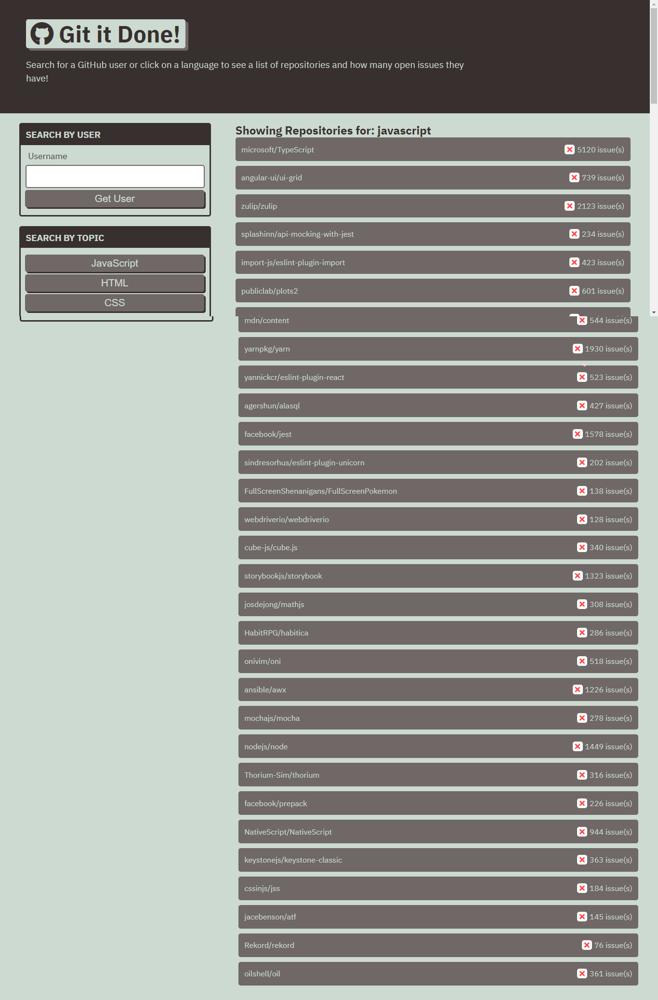

# Luiz Guilherme Padredi

# Git it Done :pencil:

## :label: Description
This program is designed so the user can search for a GitHub username and find all of their repositories and currently open issues. Alternatively, the user may also click on one of the three options to see a list of repos that have been most active on github via the collaboration of many different coders. If there are issues, then the user can click on the repo to see all open issues. Then the user may click on an issue to be directed to the GitHub issue page.

## 	:hash: Coding Languages Used
:heavy_check_mark: HTML 
:heavy_check_mark: CSS 
:heavy_check_mark: JavaScript 
:heavy_check_mark: Web APIs 

## :desktop_computer: Website
Link to Website: https://padredilg.github.io/git-it-done/
  
Screenshot from Website:

## :clap: Credits
:hammer_and_wrench: Created by Luiz Guilherme Padredi
